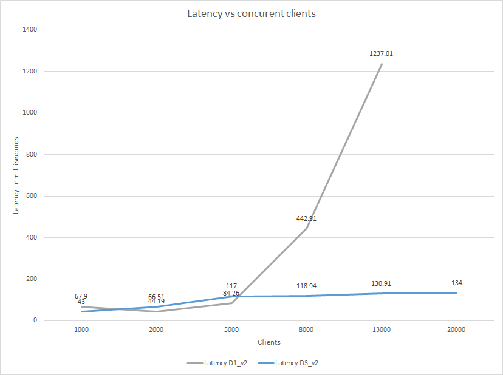

Production-ready server-side Blazor

ASP.NET Core 3.0 ships with the first major release of server-side Blazor. Server-side Blazor builds on top of ASP.NET Core & SignalR. We understand the performance characteristics, programming patterns, and ways to benchmark these parts. Server-side Blazor introduces a fair bit of novelty to the mix. In this article, we'll look at how we went about profiling, our guidance for capacity planning, as well some DOs and DONTs when authoring a server-side application.

### Benchmarking the framework

The Blazor framework has an in-memory representation of the application's UI state. Events - either a browser UI event such as clicking a button or navigating, or internally raised by the application such as a timer, may cause Components to change this UI state. Blazor reconciles the previous and current UI state and produces a patch, or a diff. A single UI event may produce multiple diffs. Diffs are translated as operations to the HTML DOM. When applied in order, the UI visible in the browser syncs with the server's representation of this state. In WebAssembly-based Blazor, DOM updates are sent over WebAsssembly-JavaScript interop. In server-side Blazor, updates are sent to the client over a SignalR connection. In both of this cases, this UI-rendering loop is at the heart of Blazor.

We realized that testing the framework required a client that understood the diffing protocol, knew how to raise DOM events, and when the DOM has updated. Using a browser-automation like Selenium seemed the obvious first choice. However, it has some limitations: (a) we wanted to automate a really large number of clients. Browser automation really doesn't scale well at the level of 1000s of instances. (b) we wanted to explore the effects of a non-conforming client on the server. Both of these requirements led us to writing a Blazor-specific client named *Ignitor*. We intend on making it available to developers in a future release. A typical usage for Ignitor looks like this:

```C#
// Find the item tracking the count of pizzas added
var pizzaOrders = client.ElementHive.FindElementById("pizzaOrders");
var initialCount = pizzaOrders.GetIntAttributeValue("pizzaCount");

// Select the 'cheese' pizza option
var pizza = await client.WaitForElementAsync("cheese", cancellationToken);
await pizza.ClickAsync(client.HubConnection, cancellationToken);

// Wait for the count of ordered pizzas to update
await client.WaitUntil(_ => pizzaOrders.GetIntAttributeValue("pizzaCount") > initialCount);
```

Fluidity or smoothness of performing UI actions is paramount to UI-based framework. In Blazor, one way to express this is to measure the time it takes for a UI-operation to take effect. Calculate the round-trip time to transfer a user interaction to the server, apply it to a component, send the updated diff and for the client apply it. This represents the UI latency where smaller values are more desirable. In the sample code shown above, the latency would time the start of the click to the count being updated.

For our benchmarks, we used

* .NET Core SDK `3.0.100-preview8-012884` and `Microsoft.AspNetCore.App` runtime version `3.0.0-preview8.19351.9`
* The default Blazor server-side template.
* An Azure-hosted server machine along with up to 4 client machines to generate load on the server. Clients and servers were located in the same region.

As part of the benchmarking scenario, we had clients navigate between the 3 pages in the default template and on the counter page, clicked on the counter button. Clients performed roughly 1 operation per second. The average UI latency was calculated over each of these operations. We varied the number of clients and captured the average latency as well as server metrics such as CPU, and working set. We tried these on two server machines: a `Standard_D1_v2` instance (1 CPU core, 3.5 GB) and a `Standard_D3_v2` instance (4 Core, 14 GB). Specifications for this series as well as other VM types offered on Azure are available here: https://docs.microsoft.com/en-us/azure/virtual-machines/windows/sizes.



In our opinion, a latency of 200 or less makes the application feel responsive. The UI feels detoriated at higher values. This indicates that a D1_V2 sized VM can effectively support about 5000 concurrent clients. A D3_V2 sized VM can support well over 20,000 concurrent clients.

### Application guidance

As part of our investigation in this area, we have some guidance for application and library authors to write Blazor code that improves the scalability of your application:

* Server-side Blazor assigns a default time-out of 1 minute for all JSInterop calls. Consider using a more aggressive timeout globally or per invocation if your application can tolerate a failure:

```C#
var cancellationTokenSource = new CancellationTokenSource(TimeSpan.FromSeconds(5));
var result = await JSRuntime.InvokeAsync("MyJSOperation", new[] { "Arg1" }, cancellationTokenSource.Token);
```

* Consider using a guard for UI actions that trigger long-running tasks. This can also be used to provide the user a visual feedback that the task is running:

```C#

<button disabled=@isLoading @onclick=@UpdateForecasts>Update</button>

@code {
    bool isLoading;
    WeatherForecast[] forecasts;

    private async Task UpdateForecasts()
    {
        if (!isLoading)
        {
            isLoading = true;
            // Long-running Task
            forecasts = await ForecastService.GetForecastAsync(DateTime.Now);
            isLoading = false;
        }
    }
}
```

* In addition to adding a guard to long-running calls, consider using a `CancellationToken` to fail early:

@implements IDisposable

@code {
    private readonly CancellationTokenSource TokenSource = new CancellationTokenSource();

    private async Task UpdateForecasts()
    {
        ...
        forecasts = await ForecastService.GetForecastAsync(DateTime.Now, TokenSource.Token);
        TokenSource.Token.ThrowIfCancellationRequested();
        ...
    }

    public void Dispose()
    {
        CancellationTokenSource.Cancel();
    }
}
```

This additionally has the benefit of avoiding use-after-dispose.
